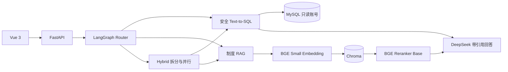

# Retail Insight Agent

面向中小零售企业的经营分析与制度知识问答智能体。用户可以用自然语言查询 MySQL 中的经营数据，也可以查询原创模拟制度；LangGraph 将问题路由到 SQL、RAG、Hybrid、Clarify 或 General 分支。

## 当前版本

当前为 **v0.3 制度 RAG 第一版**，已经实现：

- FastAPI `POST /api/v1/chat` 与 LangGraph 条件路由；
- DeepSeek V4 Pro Anthropic 兼容客户端；
- 安全 Text-to-SQL：Schema 注入、JSON 计划、SQLGlot AST、表字段白名单、危险函数拦截、LIMIT、超时、只读执行及最多 2 次纠错；
- MySQL 8.4 模拟零售库：12 家门店、60 个商品、4000 笔订单、10005 条订单明细；
- 8 份原创 Markdown 制度、标题感知分块和稳定段落编号；
- `BAAI/bge-small-zh-v1.5` + Chroma Top 12 召回；
- `BAAI/bge-reranker-base` Top 5 重排、0.1 证据阈值及低相关度拒答；
- DeepSeek 基于证据生成答案，只返回答案中实际使用的 `[数字]` 引用；
- Hybrid 问题拆分为数据与制度子问题并行执行；
- Vue 3 + TypeScript + Element Plus + ECharts 页面，展示 SQL、表格、图表、引用、错误状态、延迟和 Token；
- CPU 版 FastAPI、Vue 与 MySQL 的完整 Docker Compose 部署；BGE 模型从主机缓存只读挂载并离线加载；
- Python 3.12、pytest、Ruff、MyPy 和可重复评测脚本。

当前真实评测结果：

- 30/30 条参考 SQL 可通过安全校验并在真实 MySQL 执行；
- 首批 5/5 条 DeepSeek Text-to-SQL 的数据库执行结果与参考结果一致；
- 20/20 条本地 RAG 召回/拒答评测通过；
- 20/20 条真实 DeepSeek RAG 评测通过，其中 17 条各返回正确制度引用，3 条库外问题零引用拒答；
- 17 条有答案 RAG 题共使用 11025 Token，平均检索 59.06ms、重排 300.60ms、LLM 3111.78ms。

评测集较小且全部为原创模拟场景，这些数字不能等同于生产环境准确率。

尚未完成：

- PDF/DOCX 解析和增量索引；
- LangGraph Checkpointer、会话持久化与 SSE；
- BM25 + 向量混合召回；
- 50～100 条 SQL/RAG/Hybrid 综合评测；
- GPU RAG API 镜像。当前 Compose 使用约 488MB 的 CPU API 镜像保证可移植部署；需要更快的 RAG 推理时，仍使用主机 Python + RTX 4060。

## 架构



详细调用链见 [docs/architecture.md](docs/architecture.md)。

## 目录

```text
app/
├── api/                 FastAPI 路由与响应模型
├── core/                配置、日志和异常
├── database/            MySQL Engine 与 Schema
├── graph/               LangGraph 路由、节点和状态
├── llm/                 DeepSeek 兼容客户端
├── rag/                 文档、检索、重排、引用
└── sql_agent/           SQL 生成、校验和执行
data/
├── documents/           8 份原创模拟制度
├── eval/                SQL 与 RAG 固定评测集
└── runtime/             本地索引和报告，Git 忽略
frontend/                Vue 3 前端
prototype/               Streamlit 早期原型
scripts/                 数据、索引、验证和评测脚本
tests/                   单元与集成测试
```

## 本地安装

### 1. Python 3.12 环境

```powershell
conda create --prefix .\.venv python=3.12 pip -y
conda activate .\.venv
python -m pip install -e ".[dev,prototype]"
Copy-Item .env.example .env
```

不要把依赖安装到系统 Python，也不要提交 `.env`。

### 2. GPU RAG 依赖

下面的首次下载可能达到数 GB；开始前应确认磁盘空间和网络流量。

```powershell
python -m pip install --no-cache-dir torch==2.11.0 --index-url https://download.pytorch.org/whl/cu128
python -m pip install --no-cache-dir -e ".[rag]"
```

本机已验证的组合为 Python 3.12、PyTorch 2.11.0+cu128、CUDA 12.8 和 RTX 4060 Laptop GPU 8GB。

### 3. 配置

```dotenv
LLM_PROVIDER=deepseek_anthropic
LLM_MODEL=deepseek-v4-pro
LLM_BASE_URL=https://api.deepseek.com/anthropic
LLM_API_KEY=仅在本机填写新密钥
DATA_AS_OF_DATE=2026-06-30

MODEL_CACHE_PATH=./data/runtime/model_cache
HOST_MODEL_CACHE_PATH=./data/runtime/model_cache
MODEL_LOCAL_FILES_ONLY=false
EMBEDDING_MODEL=BAAI/bge-small-zh-v1.5
RERANKER_MODEL=BAAI/bge-reranker-base
```

首次索引/模型验证完成后可把 `MODEL_LOCAL_FILES_ONLY` 改为 `true`，避免已缓存模型启动时仍访问 Hugging Face。模型缓存也可以放到仓库外的其他磁盘目录。

如果 Key 曾出现在聊天、截图、日志或 Git 历史中，必须撤销并重新生成。

## 运行

### MySQL

```powershell
python scripts/generate_seed_data.py
docker compose up -d mysql
python scripts/verify_database.py
```

主机端口为 `3307`，容器内仍为 `3306`。应用账号 `retail_readonly` 仅拥有 SELECT 权限。

### 制度索引

```powershell
python scripts/index_policies.py
python scripts/verify_rag_stack.py
```

模型已缓存且启用离线模式时，可额外设置：

```powershell
$env:HF_HUB_OFFLINE="1"
```

### FastAPI

```powershell
uvicorn app.main:app --reload
```

- 文档：<http://localhost:8000/docs>
- 健康检查：<http://localhost:8000/api/v1/health>

### 完整 Docker Compose（CPU RAG）

先确保两个 BGE 模型已下载，并在本机 `.env` 中将 `HOST_MODEL_CACHE_PATH` 指向 Hugging Face 缓存根目录。例如：

```dotenv
HOST_MODEL_CACHE_PATH=E:/AIModels/huggingface
```

随后运行：

```powershell
docker compose --progress plain build api
docker compose up -d --force-recreate api frontend
docker compose ps
```

Compose 将模型缓存只读挂载到容器 `/models`，并启用 Hugging Face/Transformers 离线模式，不会在每次启动时重新下载模型。访问 <http://localhost:8080>；API 为 <http://localhost:8000>。本机实测镜像约 488MB，冷启动首个 RAG 请求约 15 秒，模型预热后同类页面请求约 2.5 秒。

### Vue

```powershell
Set-Location frontend
npm.cmd install
npm.cmd run dev
```

访问 <http://localhost:5173>。图表由后端白名单 `chart_spec` 和真实 SQL 结果驱动，不使用生图模型。

## 测试与评测

```powershell
python -m ruff check app tests scripts
python -m mypy app scripts
python -m pytest

$env:RUN_DB_TESTS="1"
python -m pytest tests/integration/test_database.py
```

需要真实 API 额度的脚本：

```powershell
python scripts/verify_deepseek.py
python scripts/evaluate_sql_smoke.py
python scripts/verify_rag_answer.py
python scripts/evaluate_rag.py
python scripts/verify_api_e2e.py
```

不调用付费模型的脚本：

```powershell
python scripts/verify_sql_references.py
python scripts/evaluate_sql_smoke.py --reuse-generated
python scripts/evaluate_rag_retrieval.py
```

评测报告写入已被 Git 忽略的 `data/runtime`，不会保存 Key。

## API 示例

```http
POST /api/v1/chat
Content-Type: application/json

{
  "query": "2026年6月哪些门店没有完成销售目标？并说明销售目标完成率在绩效中的权重。",
  "session_id": "demo-session"
}
```

响应会根据分支返回 `generated_sql`、`sql_result`、`chart_spec`、`citations`、`errors` 和 `metrics`。引用包含制度名、版本、章节、段落编号、原文片段和相关度。

## 安全边界

- 数据库使用只读账号；
- 只允许单条 SELECT/CTE；
- SQLGlot 校验物理表、物理字段以及 CTE/派生表输出字段；
- 拒绝写操作、危险函数、未知表字段和超大 LIMIT；
- 查询设置超时和最大返回行数；
- SQL 错误纠错最多 2 次，不向模型发送密码、连接串或内部堆栈；
- RAG 低证据拒答，只返回答案实际引用的片段；
- `.env`、Chroma 索引、模型缓存和评测报告不进入 Git。

## 开源与归属

项目采用 MIT License。参考项目、保留内容与重写原则见 [NOTICE.md](NOTICE.md)。制度文档和模拟经营数据为本项目公开演示用途，不包含真实企业隐私。
