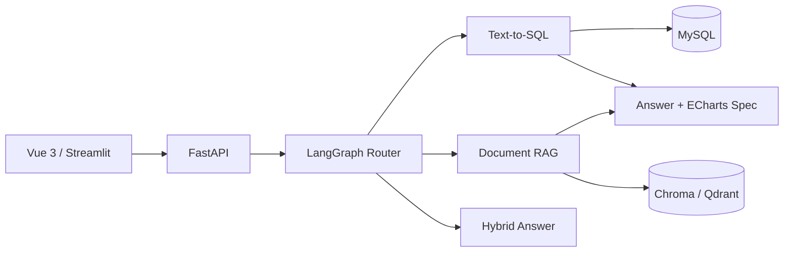

# Retail Insight Agent

面向中小零售企业的经营分析与制度知识问答智能体。

项目目标是让用户通过自然语言查询销售、订单、库存和退货等结构化经营数据，也能查询促销审批、退换货规范等非结构化制度文档。LangGraph 负责将问题路由到 SQL、RAG、混合或澄清分支。

## 当前阶段

当前版本为 **v0.1 基础框架**，已经完成：

- FastAPI 应用、健康检查和聊天接口；
- LangGraph 条件路由骨架；
- SQL、RAG、Hybrid、Clarify、General 五类分支；
- SQLGlot 只读 SQL 校验入口；
- SQL/RAG 服务契约和明确的未配置提示；
- MySQL 零售业务表 Schema；
- pytest 单元测试与 API 集成测试骨架；
- Streamlit 原型页面；
- Vue 3 + TypeScript + Element Plus + ECharts 前端骨架；
- Dockerfile 与 Docker Compose；
- 环境变量模板、许可证和开源来源说明。

已完成的基础验证：后端 pytest 11 个用例通过、Ruff 通过、MyPy 27 个源文件通过、Vue 生产构建通过、npm 审计为 0 个已知漏洞。

以下能力尚未完成，不应在简历中描述为已实现：

- LLM API 接入和真实 SQL 生成；
- MySQL 只读查询执行器；
- LangGraph Checkpointer 会话持久化；
- 文档解析、Embedding、向量库和 Reranker；
- SSE 流式输出；
- 真实经营数据、制度文档和评测集；
- 依赖锁文件与完整端到端测试。

## 架构



更详细的说明见 [docs/architecture.md](docs/architecture.md)。

## 目录

```text
app/                    FastAPI 后端
├── api/                请求模型和 HTTP 路由
├── core/               配置、日志和异常
├── database/           数据库连接
├── evaluation/         评测指标与后续评测器
├── graph/              LangGraph 状态、节点、路由和工作流
├── observability/      延迟、Token、成本和错误指标
├── rag/                RAG 模块接口
└── sql_agent/          Text-to-SQL 与安全校验
frontend/               Vue 3 最终前端
prototype/              Streamlit 快速验证页面
data/                   数据、制度文档和评测集
tests/                  单元与集成测试
```

## 本地开发

### 1. 创建 Python 3.11 环境

当前项目明确使用 Python 3.11。不要把依赖安装到系统默认环境。

```powershell
conda create -n retail-insight python=3.11 -y
conda activate retail-insight
python --version
```

### 2. 安装后端依赖

```powershell
python -m pip install -e ".[dev,prototype]"
Copy-Item .env.example .env
```

随后编辑 `.env`。不要提交真实 API Key。

### 3. 启动后端

```powershell
uvicorn app.main:app --reload
```

- API 文档：<http://localhost:8000/docs>
- 健康检查：<http://localhost:8000/api/v1/health>

### 4. 运行测试

```powershell
python -m pytest
```

### 5. 启动 Streamlit 原型

```powershell
streamlit run prototype/streamlit_app.py
```

### 6. 启动 Vue 前端

Windows PowerShell 当前可能阻止 `npm.ps1`，因此使用 `npm.cmd`，不需要修改系统执行策略：

```powershell
Set-Location frontend
npm.cmd install
npm.cmd run dev
```

访问 <http://localhost:5173>。

## Docker Compose

安装 Docker Desktop 后，可执行：

```powershell
docker compose up --build
```

- Vue 前端：<http://localhost:8080>
- FastAPI：<http://localhost:8000>
- MySQL：`localhost:3306`

当前 Compose 主要用于验证基础服务编排。生产环境必须更换密码、使用密钥管理、限制数据库端口并创建真正的只读查询账号。

## API 示例

```http
POST /api/v1/chat
Content-Type: application/json

{
  "query": "华东区域本月销售额是多少？",
  "session_id": "demo-session"
}
```

基础框架会完成路由，但 SQL 和 RAG 分支目前返回明确的“尚未配置”提示，不会伪造查询结果。

## 安全边界

- 只允许经过 AST 校验的 SELECT/CTE；
- 后续数据库连接必须使用只读账号；
- 表和字段需要白名单；
- 设置行数、时间和重试上限；
- 禁止 LLM 生成的任意 Python 代码在主进程执行；
- ECharts 只接受后端校验后的结构化图表配置；
- 无文档证据时，RAG 分支必须拒绝编造答案。

## 开源与归属

项目采用 MIT License。参考项目与二次开发原则见 [NOTICE.md](NOTICE.md)。
