# Retail Insight Agent

> 面向零售经营分析的 AI 应用工程项目：自然语言查经营数据库、查询制度知识库，并通过 LangGraph 完成 SQL、RAG、Hybrid 路由与可审计结果展示。


当前端到端基线为 `v11-multiturn-resilience-20260726`，RAG 检索消融批次为 `v12-rag-ablation-20260729`。正常集 `55/55`、挑战集 `12/12`、真实多轮 `8/8`、故障恢复 `3/3`；消融实验覆盖 100 份原创模拟制度、484 个 chunk 和 80 条 chunk 级问题。完整结果见 [v1.1 端到端评测](docs/EVALUATION_V11.md) 与 [v1.2 RAG 消融评测](docs/EVALUATION_RAG_ABLATION_V12.md)。所有数字均不等同于生产环境准确率。

面向中小零售企业的经营分析与制度知识问答智能体。用户可以用自然语言查询 MySQL 中的经营数据，也可以查询原创模拟制度；LangGraph 将问题路由到 SQL、RAG、Hybrid、Report、Clarify 或 General 分支。

## 项目概述

这个项目解决的是一个典型 AI 应用问题：企业用户不想写 SQL，也不想在制度文件里翻页，但答案又必须可验证、可追溯、可拒答。

- **SQL 分析**：自然语言生成只读 SQL，经过 Schema/字段白名单、SQLGlot AST、危险节点拦截、LIMIT、超时和最多 2 次纠错后执行。
- **RAG 问答**：100 份原创模拟 Markdown/PDF/DOCX 制度经标题感知分块形成 484 个 chunk，使用向量 + BM25 + RRF + Reranker 检索，只返回答案实际使用的引用；证据不足时拒答。扫描版 PDF 可选使用 Qwen 视觉 OCR 回退，并保留来源页码。
- **Hybrid 联查**：将经营数据问题和制度问题拆分并行执行，合并为带数据库结果和制度依据的答案。
- **多轮报告 Agent**：在已有 SQL/Hybrid 结果上启用受控 ReAct Tool Calling，可按需检索制度依据并生成带来源的 HTML 报告。
- **工程闭环**：SSE 进度流、SQLite 会话历史、Schema/制度只读抽屉、CSV/SQL 导出、评测批次对比和演示模式。
- **可验证性**：保留正常集、挑战集、多轮集、故障恢复集及历史失败样本，不只展示成功截图。

## 页面截图

页面截图：分析工作台使用零 Token 演示模式；评测页、Schema 和制度抽屉来自真实本地运行模式，数据和评测报告均来自原创模拟环境：

| 分析工作台                                         | v1.1 评测结果                                         |
| -------------------------------------------------- | ----------------------------------------------------- |
| 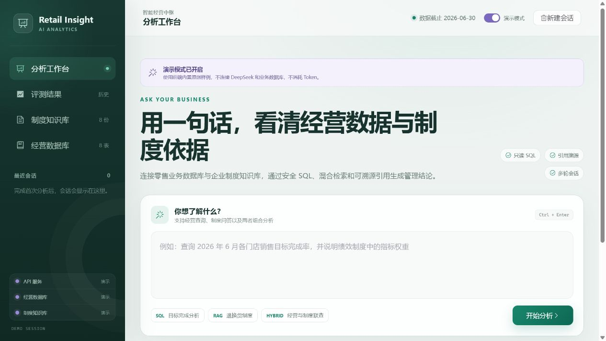 | 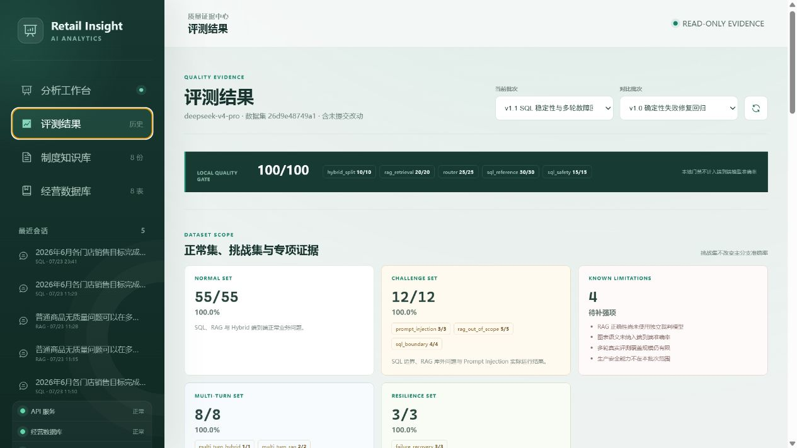 |

| Schema 抽屉                                              | 制度知识库抽屉                                    |
| -------------------------------------------------------- | ------------------------------------------------- |
| 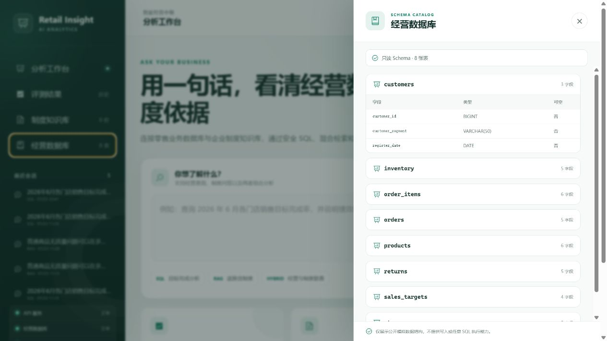 | 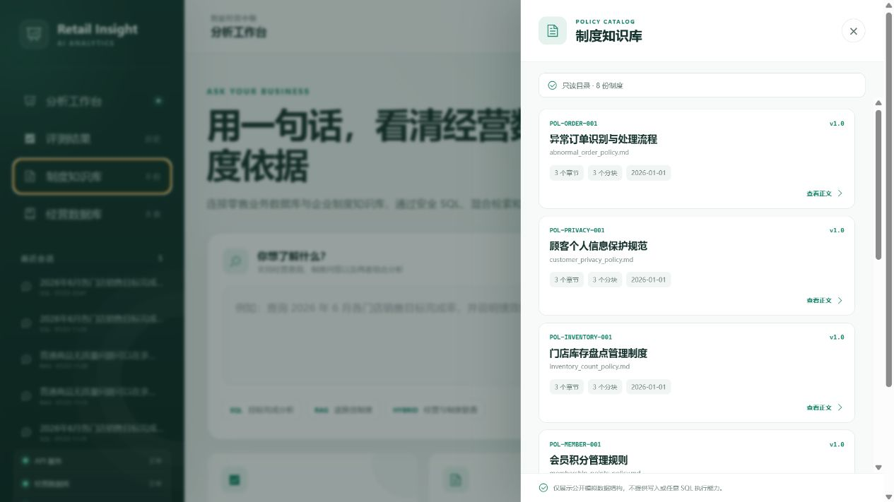 |

### v1.2 RAG 检索消融

评测页基于 80 条 chunk 级 Ground Truth，对 Vector、BM25、RRF、RRF + BGE Reranker 展示 Hit@5、MRR@5、nDCG@5、P50/P95 延迟和失败样本。

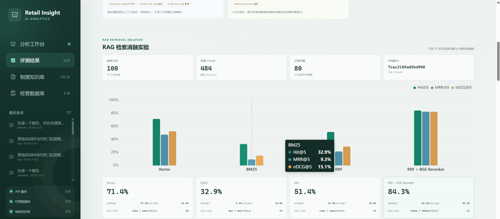

### 报告生成与受控 ReAct

用户完成 SQL 或 Hybrid 分析后，可以在同一会话中继续要求生成报告。`report_agent` 会复用来源轮次的数据结果，按需检索制度依据，并通过白名单工具生成带数据来源的 HTML 报告。

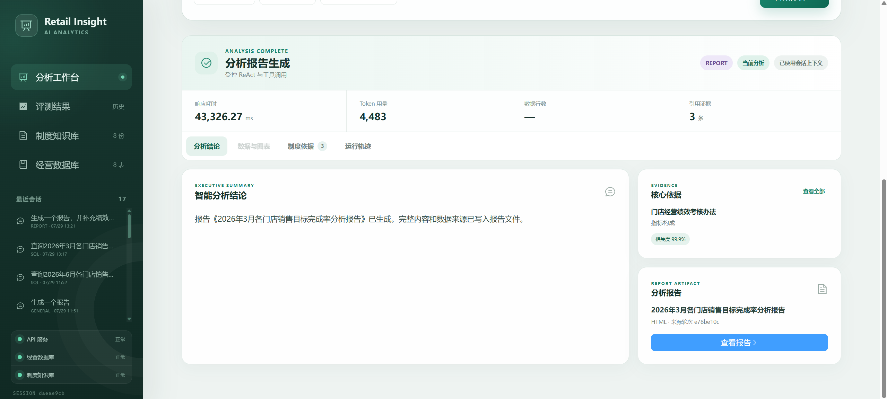

生成的报告保留执行摘要、数据概览、关键发现、制度依据、查询明细和来源 SQL；文件路径和报告 ID 由服务端生成，模型不能传入本地路径或任意 HTML。

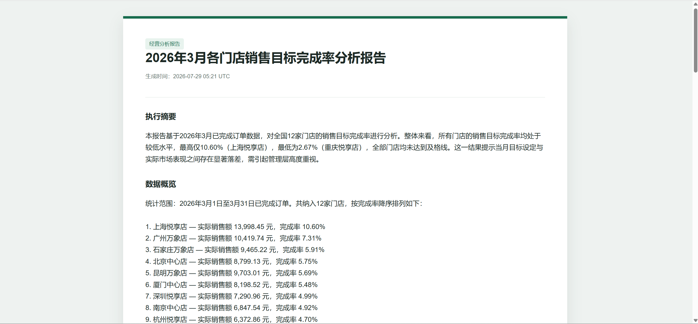

### LangSmith 运行可观测性

真实 Hybrid 请求会在 LangSmith 中展示 LangGraph 路由、Hybrid 并行分支、两次 DeepSeek 调用、RAG 召回与重排、SQL 执行和会话持久化。报告请求还会展示 `report_agent`、受控 LLM 决策、`tool.search_policy_evidence` 和 `tool.render_analysis_report`。追踪数据经过密钥脱敏、数据库结果行省略、制度片段截断和报告正文省略后再发送。

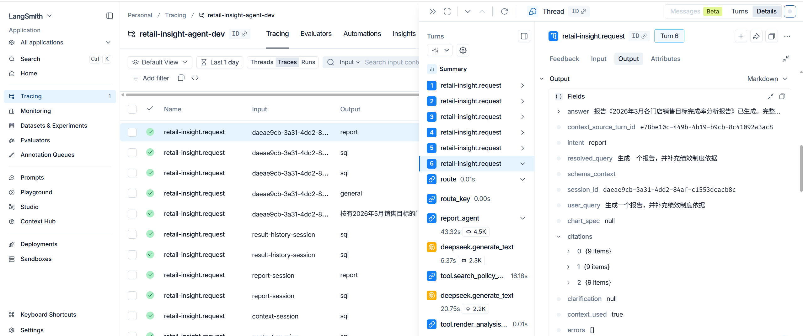

访问 `http://localhost:8080/?demo=1` 可进入零 Token 演示模式。

## 当前版本：v1.2

v1.2 在 v1.1 的端到端评测、失败分析、多轮追问和故障恢复基础上，补充了受控报告 Agent、100 份模拟制度语料、chunk 级 Ground Truth、四组 RAG 消融实验及前端可视化：

- FastAPI `POST /api/v1/chat` 与 LangGraph 条件路由；
- DeepSeek V4 Pro Anthropic 兼容客户端；
- 可选 LangSmith 运行追踪：LangGraph 节点、DeepSeek、SQL 执行、RAG 召回与重排；
- 安全 Text-to-SQL：Schema 注入、JSON 计划、SQLGlot AST、表字段白名单、危险函数拦截、LIMIT、超时、只读执行及最多 2 次纠错；
- MySQL 8.4 模拟零售库：12 家门店、60 个商品、4000 笔订单、10005 条订单明细；
- Markdown/PDF/DOCX 统一制度加载、标题感知分块、PDF 页码和稳定段落编号；
- 可选 Qwen3.7 Plus 扫描版 PDF OCR 回退：仅在原生文本提取全部为空时逐页调用，保留页码并设置页数、Token 与超时上限；
- 文件 SHA-256 清单驱动的 Chroma 增量更新，未变更文档不重复计算 Embedding；
- `BAAI/bge-small-zh-v1.5` 向量召回 + 中文字符/双字词 BM25，通过 RRF 融合后保留 Top 12；
- `BAAI/bge-reranker-base` Top 5 重排、0.1 证据阈值及低相关度拒答；
- 100 份原创模拟制度覆盖 10 个业务域，经一致性校验形成 484 个唯一 chunk；
- 80 条 chunk 级 Ground Truth 覆盖 60 条直接事实、10 条跨文档和 10 条库外问题；
- Vector、BM25、RRF、RRF + BGE Reranker 四组本地消融实验，统一计算 Hit@5、MRR@5、nDCG@5 和 P50/P95 延迟；
- DeepSeek 基于证据生成答案，只返回答案中实际使用的 `[数字]` 引用；
- Hybrid 问题拆分为数据与制度子问题并行执行；
- 报告追问进入独立 `report_agent` 节点：最多两次白名单工具调用，支持制度证据检索和 HTML 报告产物生成；
- 工具参数使用 Pydantic `extra=forbid` 校验，报告文件使用随机 ID 和会话 ID 校验，不允许模型指定路径、SQL 或 Shell；
- Vue 3 + TypeScript + Element Plus + ECharts 展示型分析工作台，包含深色导航、示例问题、SSE 进度、结果分区和响应式布局；
- 分析结果按“结论、数据与图表、制度依据、运行轨迹”组织，支持 CSV 导出、SQL 复制、会话快速复用以及引用位置与相关度展示；
- Element Plus 按需注册、ECharts 模块化注册与异步加载；首屏主 JS 从 2197.88KB 降至 384.28KB，CSS 从 359.49KB 降至 89.27KB；
- CPU 版 FastAPI、Vue 与 MySQL 的完整 Docker Compose 部署；BGE 模型从主机缓存只读挂载并离线加载；
- LangGraph `AsyncSqliteSaver` Checkpointer、最近 20 轮轻量会话记录、查询与清空接口；
- `POST /api/v1/chat/stream` SSE 节点进度流，含 10 秒心跳、最终结果与安全错误事件；
- Vue 将会话 ID 保存在浏览器本地，刷新后从 SQLite 恢复历史，并可清空后创建新会话；
- 基础上下文追问解析：将“那华东呢”“换成五月”“只看未达标门店”“这个制度的申诉期限呢”等短追问与最近一次分析问题组合，不增加额外 LLM 调用；Hybrid 追问会同时传给 SQL 与 RAG 子分支；
- 统一 100 项本地评测：30 条 SQL 参考执行、20 条 RAG 召回/拒答、25 条路由、10 条 Hybrid 拆分和 15 条 SQL 安全边界；
- SSE 内部失败返回统一安全错误，不向页面暴露连接信息或堆栈；
- Python 3.12、120 个 pytest 用例（117 个通过、3 个按环境跳过）、Ruff、MyPy 和可重复评测脚本。

前端交互与运行模式：

- Checkpointer 保存每轮轻量结果快照，历史会话可恢复对应回答、SQL、表格、图表、引用和指标；SQL 历史行数最多保存前 100 行并保留原始总行数；
- “经营数据库”和“制度知识库”提供只读元数据抽屉，分别查看真实表字段和 100 份原创模拟制度目录；
- `?demo=1` 进入前端演示模式，使用内置 SQL/RAG/Hybrid 样例，不调用 DeepSeek、不访问真实数据库、不写入真实会话；
- 报告结果会在运行轨迹中展示工具名称、状态、参数摘要和耗时，并提供报告产物入口；
- 页面启动时实际检查 API、经营数据库和制度知识库状态，并提供检查中、正常、异常和演示四类提示。

当前真实评测结果：

- 30/30 条参考 SQL 可通过安全校验并在真实 MySQL 执行；
- 完整 30 条真实 DeepSeek Text-to-SQL 通过 30/30，包含 Top-N、聚合、状态枚举和复杂 CTE 场景；
- 20/20 条本地 RAG 召回/拒答评测通过；
- v1.2 RAG 消融评测覆盖 100 份制度、484 个 chunk 和 80 条问题；RRF + BGE Reranker 达到 Hit@5 `84.3%`、MRR@5 `82.5%`、nDCG@5 `82.4%`；
- 100/100 项完整本地综合评测通过，两次运行约 23～28 秒，付费 LLM 调用为 0；
- 20/20 条真实 DeepSeek RAG 评测通过，其中 17 条有答案题返回制度引用，3 条库外问题零引用拒答；本批次使用 2,544 Token；
- 5/5 条真实 DeepSeek Hybrid 问题通过数据库结果与制度引用双重校验，本批次使用 4,493 Token；
- 8/8 组真实双轮追问通过：SQL 5 组、RAG 2 组、Hybrid 1 组；
- 3/3 故障恢复评测通过：LLM API 超时、LLM 格式异常、数据库超时；
- 12/12 挑战集通过：SQL 边界、RAG 库外问题和 Prompt Injection；
- Docker 页面真实验收通过：评测页展示正常/挑战/多轮/故障专项、优化说明、历史失败和已知限制；E2E `11 passed, 1 skipped`。
- Qwen3.7 Plus OCR 真实连通验证通过：图片型单页 PDF 自动进入 OCR 回退，日期、金额等固定校验项 `3/3` 命中。

语料和评测问题全部为原创模拟场景，尚未经过真实企业制度验证、双人独立标注或线上流量检验；这些数字不能等同于生产环境准确率。

已知限制：

- OCR 目前只支持开发者将扫描版 PDF 放入制度目录后运行索引脚本，不包含网页上传、手写体校对、复杂表格结构还原和置信度标注；
- RAG 已增加 chunk 级 Hit@5、MRR@5、nDCG@5 与四组消融，但尚未使用独立裁判模型，不等同于最终答案的逐句事实一致性；
- 多轮真实评测目前为 8 组双轮问题，不能代表更长会话、跨天追问和复杂指代；
- 图表目前校验类型和字段合法性，尚未评价图表类型是否最适合问题；
- 认证、细粒度权限、审计、限流和线上监控不在当前离线评测范围；
- GPU RAG API 镜像仍未单独发布，Compose 使用 CPU 版保证可移植部署。
- 报告 Agent 首版只支持 HTML，不能直接生成 DOCX/PDF；报告必须建立在当前会话已有 SQL/Hybrid 结构化结果上，尚未接入异步队列和复杂长会话摘要。

## 架构

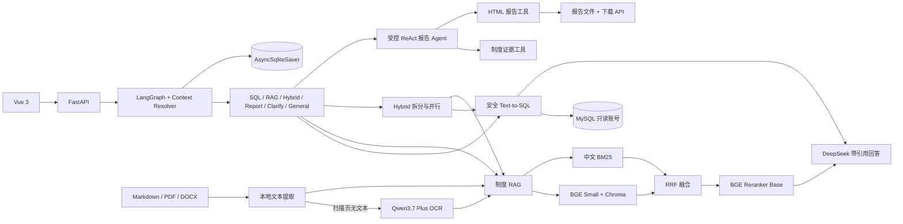

### LangGraph 主工作流

核心 SQL、RAG 和 Hybrid 链路继续使用确定性编排，报告生成作为独立 `report_agent` 分支接入。所有分支最终进入 `persist_turn`，统一保存安全结果快照。

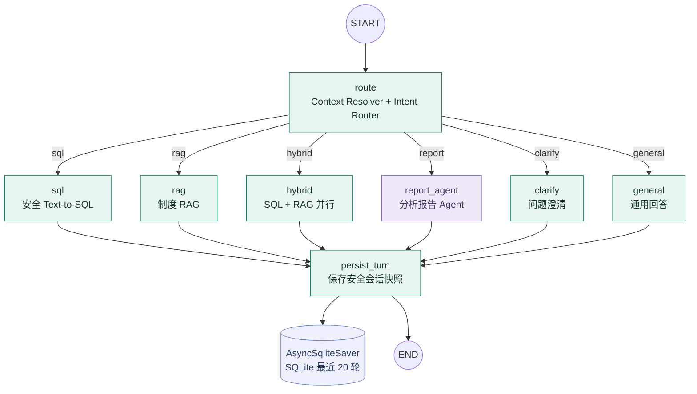

### 报告 Agent 内部受控 ReAct

`report_agent` 最多执行两个工具调用。只有报告需要制度依据时才调用制度检索工具，最终必须通过报告渲染工具生成产物；未知工具、无效参数、超时和调用超限都会返回安全失败结果。

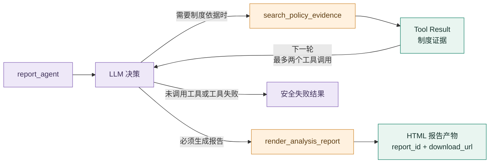

详细调用链见 [docs/architecture.md](docs/architecture.md)。

## 目录

```text
app/
├── api/                 FastAPI 路由与响应模型
├── core/                配置、日志和异常
├── database/            MySQL Engine 与 Schema
├── graph/               LangGraph 路由、节点和状态
├── llm/                 DeepSeek 兼容客户端
├── rag/                 文档、扫描 PDF OCR、检索、重排、引用
├── tools/               白名单工具、受控报告 Agent 与 HTML 产物
└── sql_agent/           SQL 生成、校验和执行
data/
├── documents/           Markdown/PDF/DOCX 制度与二进制文档元数据侧车
├── eval/                SQL 与 RAG 固定评测集
└── runtime/             本地索引和报告，Git 忽略
frontend/                Vue 3 前端
prototype/               Streamlit 早期原型
docs/
├── architecture.md      架构与调用链
├── EVALUATION_V11.md     v1.1 真实评测摘要
├── EVALUATION_RAG_ABLATION_V12.md  v1.2 RAG 检索消融评测
└── screenshots/          GitHub 页面截图
scripts/                 数据、索引、验证和评测脚本
tests/                   单元与集成测试
```

## 本地安装

### 1. Python 3.12 环境

```powershell
conda create --prefix .\.venv python=3.12 pip -y
conda activate .\.venv
python -m pip install -e ".[dev,prototype]"
Copy-Item .env.example .env
```

不要把依赖安装到系统 Python，也不要提交 `.env`。

### 2. GPU RAG 依赖

下面的首次下载可能达到数 GB；开始前应确认磁盘空间和网络流量。

```powershell
python -m pip install --no-cache-dir torch==2.11.0 --index-url https://download.pytorch.org/whl/cu128
python -m pip install --no-cache-dir -e ".[rag]"
```

本机已验证的组合为 Python 3.12、PyTorch 2.11.0+cu128、CUDA 12.8 和 RTX 4060 Laptop GPU 8GB。

### 3. 配置

```dotenv
LLM_PROVIDER=deepseek_anthropic
LLM_MODEL=deepseek-v4-pro
LLM_BASE_URL=https://api.deepseek.com/anthropic
LLM_API_KEY=仅在本机填写新密钥
DATA_AS_OF_DATE=2026-06-30

LANGSMITH_TRACING=true
LANGSMITH_API_KEY=仅在本机填写 LangSmith 密钥
LANGSMITH_PROJECT=retail-insight-agent-dev
LANGSMITH_ENDPOINT=https://api.smith.langchain.com

MODEL_CACHE_PATH=./data/runtime/model_cache
HOST_MODEL_CACHE_PATH=./data/runtime/model_cache
MODEL_LOCAL_FILES_ONLY=false
EMBEDDING_MODEL=BAAI/bge-small-zh-v1.5
RERANKER_MODEL=BAAI/bge-reranker-base
LEXICAL_CORPUS_PATH=./data/runtime/bm25_corpus.json
RAG_VECTOR_TOP_K=20
RAG_BM25_TOP_K=20
RAG_RRF_K=60

REPORT_OUTPUT_PATH=./data/runtime/reports
REPORT_TOOL_TIMEOUT_SECONDS=20
REPORT_MAX_TOOL_CALLS=2
```

首次索引/模型验证完成后可把 `MODEL_LOCAL_FILES_ONLY` 改为 `true`，避免已缓存模型启动时仍访问 Hugging Face。模型缓存也可以放到仓库外的其他磁盘目录。

如果 Key 曾出现在聊天、截图、日志或 Git 历史中，必须撤销并重新生成。

LangSmith 默认关闭，只有同时配置 `LANGSMITH_TRACING=true` 和 `LANGSMITH_API_KEY` 才会发送追踪。追踪会记录 LangGraph 节点、模型调用、SQL、RAG 召回和重排；发送前统一删除密钥、请求头、连接串和数据库结果明细，制度内容按长度截断。不同环境建议使用独立项目名，例如 `retail-insight-agent-dev` 和 `retail-insight-agent-evaluation`。

## 运行

### MySQL

```powershell
python scripts/generate_seed_data.py
docker compose up -d mysql
python scripts/verify_database.py
```

主机端口为 `3307`，容器内仍为 `3306`。应用账号 `retail_readonly` 仅拥有 SELECT 权限。

### 制度索引

当前支持开发者导入制度文档：把文件放入 `data/documents` 后运行索引脚本。项目尚未提供前端上传按钮、文件上传 API 或上传后自动索引任务。

Markdown 直接在 YAML frontmatter 中声明元数据。PDF/DOCX 需要同目录、同完整文件名的侧车文件，例如 `return_policy.pdf.metadata.json`：

```json
{
  "document_id": "POL-RETURN-002",
  "title": "退换货补充制度",
  "version": "1.0",
  "effective_date": "2026-07-01"
}
```

PDF 优先使用本地原生文本提取；当所有页面均无可提取文本时，只有在显式启用 OCR 后才会渲染页面并发送至 Qwen 视觉模型。OCR 结果按页进入索引并保留引用页码；未启用时会明确提示配置方式。DOCX 按 Heading 样式分节，表格按文本行进入索引。

扫描版 PDF 的可选配置如下（仅对已确认可外发的非敏感文档启用；当前仅支持将文件放入 `data/documents` 后运行索引脚本，不提供网页上传）：

```dotenv
OCR_ENABLED=true
OCR_PROVIDER=qwen_openai_compatible
OCR_MODEL=qwen3.7-plus
OCR_BASE_URL=https://dashscope.aliyuncs.com/compatible-mode/v1
OCR_API_KEY=仅本地填写
```

完成配置后，可运行一页无敏感内容的连通测试；脚本会临时生成并外发一张仅含日期和金额示例的扫描页，不会读取 `data/documents` 中的制度文件：

```powershell
python scripts/verify_ocr.py
```

```powershell
python scripts/index_policies.py
python scripts/verify_rag_stack.py
```

默认命令按源文件及侧车文件 SHA-256 增量更新，同时生成 Git 忽略的 Chroma 索引清单和 BM25 语料。文档新增、修改、删除都会同步；需要排障时可执行 `python scripts/index_policies.py --full-rebuild` 强制全量重建。

模型已缓存且启用离线模式时，可额外设置：

```powershell
$env:HF_HUB_OFFLINE="1"
```

### FastAPI

```powershell
uvicorn app.main:app --reload
```

- 文档：[http://localhost:8000/docs](http://localhost:8000/docs)
- 健康检查：[http://localhost:8000/api/v1/health](http://localhost:8000/api/v1/health)

### 完整 Docker Compose（CPU RAG）

先确保两个 BGE 模型已下载，并在本机 `.env` 中将 `HOST_MODEL_CACHE_PATH` 指向 Hugging Face 缓存根目录。例如：

```dotenv
HOST_MODEL_CACHE_PATH=E:/AIModels/huggingface
```

随后运行：

```powershell
docker compose --progress plain build api
docker compose up -d --force-recreate api frontend
docker compose ps
```

如果只修改了后端或 OCR 代码，无需重建前端，可仅重建并替换 API 容器：

```powershell
docker compose --progress plain build api
docker compose up -d --force-recreate api
docker compose ps
docker compose logs --tail=100 api
```

Compose 将模型缓存只读挂载到容器 `/models`，并启用 Hugging Face/Transformers 离线模式，不会在每次启动时重新下载模型。访问 [http://localhost:8080](http://localhost:8080)；API 为 [http://localhost:8000](http://localhost:8000)。CPU API 镜像实测约 494MB，冷启动首个 RAG 请求约 15 秒，模型预热后同类页面请求约 2.5 秒。当前 Docker 依赖分层的新缓存首次构建约 317.3 秒，紧接着的零变更构建全部命中缓存，约 2.7 秒完成；该数据仅代表同机热缓存场景。

`data/runtime` 挂载到容器内同名目录，SQLite 会话数据库因此能跨 API 容器重启保留。会话只保留最近 20 轮轻量记录；系统支持基于最近一次分析问题的短追问解析，复杂多实体指代和跨多轮摘要仍未实现。

### Vue

```powershell
Set-Location frontend
npm.cmd install
npm.cmd run dev
```

访问 [http://localhost:5173](http://localhost:5173)。图表由后端白名单 `chart_spec` 和真实 SQL 结果驱动，支持柱状图、折线图、饼图和数值轴散点图，不使用生图模型。

## 测试与评测

### RAG 检索消融实验

本版本将制度库扩充到 100 份原创模拟制度、484 个稳定 chunk，并建立 80 条 chunk 级 Ground Truth（70 条可回答、10 条库外诊断题）。`evaluate_rag_ablation.py` 在完全本地的四组 Pipeline 上计算标准排序指标、延迟和失败样本，不调用 DeepSeek、LangSmith 或数据库。

| Pipeline | Hit@5 | MRR@5 | nDCG@5 | P50 | P95 | 失败样本 |
|---|---:|---:|---:|---:|---:|---:|
| Vector | 71.43% | 47.31% | 52.54% | 13.25ms | 22.35ms | 20 |
| BM25 | 32.86% | 9.31% | 15.05% | 6.09ms | 8.75ms | 47 |
| RRF | 51.43% | 21.50% | 28.99% | 13.34ms | 22.49ms | 34 |
| **RRF + BGE Reranker** | **84.29%** | **82.50%** | **82.36%** | 191.40ms | 203.46ms | **11** |

RRF + BGE Reranker 相对纯 Vector 的 Hit@5 提高 12.86 个百分点，说明在结构相似的模拟 SOP 中，Reranker 能有效纠正同主题错误章节的排序。纯 RRF 低于 Vector 也被保留：词法召回噪声说明融合并不天然带来增益，必须通过消融验证。完整口径、结果分析、复现命令和限制见 [v1.2 RAG 检索消融评测](docs/EVALUATION_RAG_ABLATION_V12.md)。库外问题不混入三项排序指标。

```powershell
python -m ruff check app tests scripts
python -m mypy app scripts
python -m pytest

$env:RUN_DB_TESTS="1"
python -m pytest tests/integration/test_database.py
```

需要真实 API 额度的脚本：

```powershell
python scripts/verify_deepseek.py
python scripts/verify_langsmith.py --live-llm
python scripts/evaluate_sql_smoke.py
python scripts/verify_rag_answer.py
python scripts/evaluate_rag.py
python scripts/evaluate_hybrid_live.py
python scripts/verify_api_e2e.py
python scripts/verify_session_stream.py --reset
python scripts/evaluate_report_agent.py --live
```

不调用付费模型的脚本：

```powershell
python scripts/verify_sql_references.py
python scripts/evaluate_sql_smoke.py --reuse-generated
python scripts/evaluate_rag_retrieval.py
python scripts/evaluate_comprehensive.py --quick
python scripts/evaluate_comprehensive.py
```

`--quick` 只运行 50 项路由、Hybrid 拆分和 SQL 安全检查；完整模式连接真实 MySQL 并加载本地 BGE，共运行 100 项，但不会调用 DeepSeek。报告写入 `data/runtime/comprehensive_eval_report.json`。

评测报告写入已被 Git 忽略的 `data/runtime`，不会保存 Key。

推荐验证顺序：

```powershell
# 不调用付费模型：固定 SQL、检索、安全和综合门禁
python scripts/verify_sql_references.py
python scripts/evaluate_rag_retrieval.py
python scripts/evaluate_comprehensive.py

# 不调用外部模型：故障恢复评测
python scripts/evaluate_resilience.py

# 真实模型评测：需要明确的 API Key 和外发授权
python scripts/evaluate_sql_smoke.py
python scripts/evaluate_rag.py
python scripts/evaluate_hybrid_live.py
python scripts/evaluate_challenges.py
python scripts/evaluate_multiturn_live.py

# 归档当前报告，run_id 必须唯一且不可覆盖
python scripts/archive_evaluation_run.py --run-id <unique-run-id> --label "<batch-label>"
```

真实评测会把原创模拟问题、Schema 或制度检索片段发送至配置的模型 API；默认开发测试不调用付费模型。`verify_langsmith.py --live-llm` 会向 LangSmith 发送脱敏隐私探针，并额外调用一次 DeepSeek，运行前同样需要明确外发授权。

`evaluate_report_agent.py` 会连续发送一条原创模拟经营查询和一条报告追问，并验证 `report_agent` 的工具选择、报告产物和调用上限。脚本必须显式添加 `--live`，运行前应重新确认将发送的问题、上一轮受控分析结果和可选制度片段。

## API 示例

```http
POST /api/v1/chat
Content-Type: application/json

{
  "query": "2026年6月哪些门店没有完成销售目标？并说明销售目标完成率在绩效中的权重。",
  "session_id": "demo-session"
}
```

响应会根据分支返回 `resolved_query`、`context_used`、`generated_sql`、`sql_result`、`chart_spec`、`citations`、`tool_calls`、`tool_results`、`report_artifact`、`errors` 和 `metrics`。报告分支只接受当前会话最近一条 SQL/Hybrid 结构化结果，产物通过 `report_artifact.download_url` 读取。引用包含制度名、版本、章节、PDF 页码（如有）、段落编号、原文片段和相关度。

流式接口为 `POST /api/v1/chat/stream`，依次发送 `start`、`node`、可选 `heartbeat`、`result` 和 `done` 事件。这里的“流式”是可观测的 LangGraph 节点进度与最终结果，不是伪造的逐 Token 输出。

会话接口：

- `GET /api/v1/sessions/{session_id}`：读取最近 20 轮；
- `DELETE /api/v1/sessions/{session_id}`：删除指定会话，不影响其他会话。
- `GET /api/v1/reports/{report_id}?session_id=<session_id>`：读取当前会话生成的 HTML 报告；会话不匹配时返回 404。

评测接口：

- `GET /api/v1/evaluation/runs`：读取历史评测批次摘要；
- `GET /api/v1/evaluation/runs/{run_id}`：读取指定批次的分支指标、RAG 消融、专项评测、优化说明、限制、失败样本和来源报告。

运行 `python scripts/archive_evaluation_run.py --run-id <唯一批次名>` 可将当前 SQL/RAG/Hybrid、多轮、故障和 RAG 消融报告归档到 `data/runtime/evaluation_runs`。前端“评测结果”页面展示准确率、拒答率、Token、P50/P95 延迟、RAG 消融图表、专项指标、优化说明、失败样本和批次对比；当前报告覆盖数量会原样显示，不会补写缺失样本。

## 安全边界

- 数据库使用只读账号；
- 只允许单条 SELECT/CTE；
- SQLGlot 校验物理表、物理字段以及 CTE/派生表输出字段；
- 拒绝写操作、危险函数、未知表字段和超大 LIMIT；
- 查询设置超时和最大返回行数；
- SQL 错误纠错最多 2 次，不向模型发送密码、连接串或内部堆栈；
- RAG 低证据拒答，只返回答案实际引用的片段；
- PDF/DOCX 使用显式元数据侧车；扫描版 PDF 不会被误建为空索引，且 OCR 必须显式启用；
- `.env`、Chroma 索引、模型缓存和评测报告不进入 Git。

## 开源与归属

项目采用 MIT License。参考项目、保留内容与重写原则见 [NOTICE.md](NOTICE.md)。制度文档和模拟经营数据仅用于本地开发与功能验证，不包含真实企业隐私。
