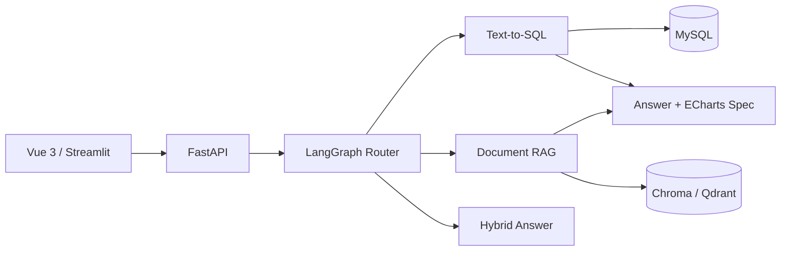

# Retail Insight Agent

面向中小零售企业的经营分析与制度知识问答智能体。

项目目标是让用户通过自然语言查询销售、订单、库存和退货等结构化经营数据，也能查询促销审批、退换货规范等非结构化制度文档。LangGraph 负责将问题路由到 SQL、RAG、混合或澄清分支。

## 当前阶段

当前版本为 **v0.2 Text-to-SQL 第一阶段**，已经完成：

- FastAPI 应用、健康检查和聊天接口；
- LangGraph 条件路由骨架；
- SQL、RAG、Hybrid、Clarify、General 五类分支；
- DeepSeek V4 Pro 的 Anthropic 兼容客户端；
- 以 `2026-06-30` 数据截止日为基准的可复现相对时间解析；
- SQLGlot AST 校验、表/字段白名单、危险函数拦截和 LIMIT 收紧；
- MySQL 8.4 零售业务库与专用只读账号；
- 可重复生成的模拟数据：12 家门店、60 个商品、4000 笔订单和 10005 条订单明细；
- Schema 自动读取、只读 SQL 执行、超时和最大返回行数；
- Mock LLM 到真实 MySQL 的完整 Text-to-SQL 集成测试；
- SQL 失败后最多 2 次自动纠错，以及 LLM/SQL/总耗时、Token 和尝试次数统计；
- 5 道真实 DeepSeek Text-to-SQL 冒烟评测，按数据库执行结果评分，当前为 5/5；
- RAG 服务契约和明确的未配置提示；
- Streamlit 原型页面；
- Vue 3 + TypeScript + Element Plus + ECharts 前端，展示回答、SQL、表格、图表和运行指标；
- Dockerfile 与 Docker Compose；
- 环境变量模板、许可证和开源来源说明。

已完成的基础验证：包含真实 MySQL 集成测试在内的 pytest 30 个用例通过、Ruff 通过、MyPy 36 个源文件通过、Vue 生产构建通过、npm 审计为 0 个已知漏洞；MySQL、FastAPI 和 Vue 三个 Compose 服务可同时运行。

以下能力尚未完成，不应在简历中描述为已实现：

- LangGraph Checkpointer 会话持久化；
- 文档解析、Embedding、向量库和 Reranker；
- SSE 流式输出；
- 制度文档和 50～100 条综合评测集；
- 将当前 5 条 SQL 冒烟题扩展到 30 条，并建立 50～100 条综合评测集。

## 架构



更详细的说明见 [docs/architecture.md](docs/architecture.md)。

## 目录

```text
app/                    FastAPI 后端
├── api/                请求模型和 HTTP 路由
├── core/               配置、日志和异常
├── database/           数据库连接
├── evaluation/         评测指标与后续评测器
├── graph/              LangGraph 状态、节点、路由和工作流
├── observability/      延迟、Token、成本和错误指标
├── rag/                RAG 模块接口
└── sql_agent/          Text-to-SQL 与安全校验
frontend/               Vue 3 最终前端
prototype/              Streamlit 快速验证页面
data/                   数据、制度文档和评测集
tests/                  单元与集成测试
```

## 本地开发

### 1. 创建 Python 3.11 环境

当前项目明确使用 Python 3.11。不要把依赖安装到系统默认环境。

```powershell
conda create -n retail-insight python=3.11 -y
conda activate retail-insight
python --version
```

### 2. 安装后端依赖

```powershell
python -m pip install -e ".[dev,prototype]"
Copy-Item .env.example .env
```

随后编辑 `.env`。不要提交真实 API Key。

DeepSeek 配置采用官方 Anthropic 兼容接口：

```dotenv
LLM_PROVIDER=deepseek_anthropic
LLM_MODEL=deepseek-v4-pro
LLM_BASE_URL=https://api.deepseek.com/anthropic
LLM_API_KEY=请在本机填写新生成的密钥
DATA_AS_OF_DATE=2026-06-30
```

如果 Key 曾经出现在聊天、截图、日志或 Git 历史中，必须先撤销后重新生成，不能继续使用。

### 3. 生成并启动演示数据库

```powershell
python scripts/generate_seed_data.py
docker compose up -d mysql
python scripts/verify_database.py
```

验证脚本会通过应用的只读账号读取 Schema，并执行一条真实区域销售聚合查询。

### 4. 启动后端

```powershell
uvicorn app.main:app --reload
```

- API 文档：<http://localhost:8000/docs>
- 健康检查：<http://localhost:8000/api/v1/health>

### 5. 运行测试

```powershell
python -m pytest
$env:RUN_DB_TESTS="1"
python -m pytest tests/integration/test_database.py
```

真实模型验证与首批 SQL 评测：

```powershell
python scripts/verify_deepseek.py
python scripts/evaluate_sql_smoke.py
python scripts/evaluate_sql_smoke.py --reuse-generated
```

最后一条命令只复用上次生成的 SQL 并查询本地数据库，不会产生新的模型调用。评测报告写入已被 Git 忽略的 `data/runtime/sql_smoke_report.json`。

### 6. 启动 Streamlit 原型

```powershell
streamlit run prototype/streamlit_app.py
```

### 7. 启动 Vue 前端

Windows PowerShell 当前可能阻止 `npm.ps1`，因此使用 `npm.cmd`，不需要修改系统执行策略：

```powershell
Set-Location frontend
npm.cmd install
npm.cmd run dev
```

访问 <http://localhost:5173>。

## Docker Compose

安装 Docker Desktop 后，可执行：

```powershell
docker compose up -d --build
```

- Vue 前端：<http://localhost:8080>
- FastAPI：<http://localhost:8000>
- MySQL：`localhost:3307`（避免与本机已有 MySQL 的 3306 端口冲突）

当前 Compose 已创建独立只读查询账号。生产环境仍必须更换所有演示密码、使用密钥管理，并禁止直接公开数据库端口。

## API 示例

```http
POST /api/v1/chat
Content-Type: application/json

{
  "query": "华东区域本月销售额是多少？",
  "session_id": "demo-session"
}
```

配置新的 DeepSeek API Key 后，SQL 分支会读取 Schema、生成 SQL、执行安全校验并通过只读账号查询 MySQL。RAG 分支尚未实现，仍会返回明确提示，不会伪造答案。

响应中的 `metrics` 包含 `attempt_count`、`prompt_tokens`、`completion_tokens`、`total_tokens`、`llm_latency_ms`、`sql_execution_ms` 和 `total_latency_ms`。

## 安全边界

- 只允许经过 AST 校验的 SELECT/CTE；
- 数据库连接使用只读账号；
- 表和字段使用 Schema 白名单；
- 设置行数和查询时间上限；
- 禁止 LLM 生成的任意 Python 代码在主进程执行；
- ECharts 只接受后端校验后的结构化图表配置；
- 无文档证据时，RAG 分支必须拒绝编造答案。

## 开源与归属

项目采用 MIT License。参考项目与二次开发原则见 [NOTICE.md](NOTICE.md)。
