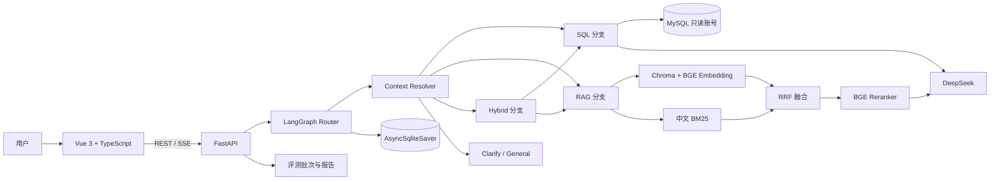

# v1.1 架构说明

Retail Insight Agent 由 Vue 3 分析工作台、FastAPI API、LangGraph 工作流、MySQL 经营数据库和本地制度 RAG 组成。系统把自然语言问题路由到 SQL、RAG、Hybrid、Clarify 或 General 分支，并统一返回答案、数据、图表配置、制度引用和运行指标。

## 系统总览



## 请求生命周期

1. Vue 将自然语言问题和保存在浏览器中的 `session_id` 发送到 `POST /api/v1/chat/stream`。
2. FastAPI 创建本轮 `AgentState`，LangGraph 从对应 `thread_id` 恢复会话状态。
3. `resolve_contextual_query` 判断输入是否为短追问；符合条件时，将其与最近一次 SQL、RAG 或 Hybrid 问题组合为 `resolved_query`，并记录 `context_used`。
4. 确定性 Router 将问题分到 SQL、RAG、Hybrid、Clarify 或 General。
5. SQL 分支查询真实 Schema、生成并校验 SQL，再用只读账号执行；RAG 分支完成混合检索、重排、证据筛选和带引用回答；Hybrid 分支并行运行 SQL 与 RAG。
6. 公共 `persist_turn` 节点保存轻量结果快照，`AsyncSqliteSaver` 将图状态写入 `data/runtime/sessions.db`。
7. FastAPI 通过 SSE 发送节点进度、心跳、最终结果和结束事件；Vue 展示结论、SQL、表格、ECharts 图表、引用和指标。

## 路由与上下文追问

Router 使用可测试的确定性规则：

- SQL：销售、订单、库存、趋势、排名、完成率等结构化数据问题；
- RAG：制度、流程、审批、规则、申诉等知识问题；
- Hybrid：同一问题同时包含数据指标和明确的制度依据；
- Clarify：时间、对象或指标不足的短问题；
- General：超出当前经营分析与制度问答范围的问题。

上下文解析只处理带“那、这个、换成、刚才、只看、仅看、呢、怎么样”等特征的短追问，并仅引用最近一次分析类 turn。完整新问题保持独立；没有分析历史时，信息不足的问题进入 Clarify。

```text
上一轮：2026年6月各区域销售额是多少？
追问：那华东呢
resolved_query：2026年6月各区域销售额是多少；基于上一问题继续追问：那华东呢
```

解析结果、`context_used` 和来源 turn ID 会进入 API 状态与会话记录。该方案不额外调用 LLM；复杂多实体指代、跨多轮约束合并和历史摘要压缩仍未实现。Hybrid 追问会把追加条件同时传给 SQL 与 RAG 子分支。

## Text-to-SQL

```text
读取 MySQL Schema
→ 注入数据截止日、表字段和业务口径
→ DeepSeek 生成 JSON SQL Plan
→ 问题约束检查（Top-N、状态枚举、聚合口径等）
→ SQLGlot AST 解析
→ 单条 SELECT / CTE 与危险节点检查
→ 物理表、物理字段白名单校验
→ CTE、派生表和投影别名校验
→ LIMIT 收紧与数据库超时
→ MySQL 只读执行
→ 校验 chart_spec 字段
```

SQL 计划包含 `sql`、`explanation` 和可选 `chart`。执行失败或计划格式异常时最多纠错 2 次；只把必要的安全校验或数据库错误发回模型，不包含密码、连接串和内部堆栈。数据库账号仅授予 SELECT 权限，并设置最大返回行数与执行超时。

图表不由模型生成图片或执行绘图代码。后端仅接收 `bar`、`line`、`pie`、`scatter` 四种白名单类型，并要求 `x_field`、`y_field` 必须存在于真实 SQL 结果列中；前端再使用 ECharts 渲染。

## 制度 RAG

### 文档导入与索引

```text
data/documents 中的 Markdown / 文本型 PDF / DOCX
→ Markdown frontmatter 或 PDF/DOCX JSON 元数据侧车
→ 标题、页码、段落感知分块
→ 稳定 chunk_id 与 paragraph_id
→ 源文件和侧车文件 SHA-256 清单
→ 增量删除 / 写入发生变化的 chunk
→ Chroma 向量索引 + BM25 语料
```

当前导入方式是开发者将文件放入 `data/documents` 后运行 `python scripts/index_policies.py`，而不是在网页上传。Markdown 在 YAML frontmatter 中声明元数据；PDF/DOCX 使用同名 `.metadata.json` 侧车。PDF 页码进入引用，DOCX 的 Heading 样式形成章节，表格转为文本行。扫描版 PDF 没有 OCR，无法提取文字时会拒绝建索引并提示先做 OCR。

增量索引比较源文件和侧车文件的 SHA-256：新增或修改文档只重算对应向量，删除文档会清理原有 chunk，零变更运行不会加载 Embedding 模型。`--full-rebuild` 只用于排障和索引格式迁移。

### 检索与回答

```text
用户问题
→ BGE + Chroma 向量 Top 20
→ 中文 BM25 Top 20
→ 两路并行召回
→ RRF(k=60) 去重融合 Top 12
→ BGE Reranker Top 5
→ relevance_score >= 0.1
→ 无足够证据时拒答
→ DeepSeek 基于证据生成带 [数字] 引用的答案
→ 只返回答案实际使用的引用
```

Embedding、Chroma、BM25 和 Reranker 均在本地运行；发送给 DeepSeek 的是筛选后的制度片段。当前阈值 0.1 来自固定评测集，更换文档或扩展题集后需要重新校准，不能视为通用常数。

## Hybrid 并行

Hybrid 节点按“并说明、同时说明、并依据、并结合”等连接词拆分数据子问题和制度子问题，再通过 `asyncio.gather` 并行运行：

```text
Hybrid 问题
├─ SQL 子问题 → MySQL 结果 + chart_spec
└─ RAG 子问题 → 制度答案 + citations
        ↓
合并回答、错误和 Token / 延迟指标
```

当前合并方式是拼接两个分支答案，尚未增加第三次统一总结调用，因此不会引入额外一次 LLM 成本。

## 会话持久化与 SSE

```text
Vue localStorage session_id
→ POST /chat/stream
→ LangGraph thread_id
→ route / branch / persist_turn 节点
→ AsyncSqliteSaver
→ SQLite sessions.db
→ SSE result / done
→ GET /sessions/{session_id} 恢复最近 20 轮
```

每轮开始时会显式清空 SQL/RAG 临时字段，避免上一轮结果进入新分支。会话最多保留最近 20 轮轻量记录；SQL 历史只保存前 100 行并保留原始总行数。当前 SQLite Checkpointer 适合单机开发，生产部署应迁移到外部持久化存储并补充生命周期管理。

SSE 事件包括 `start`、`node`、`heartbeat`、`result`、`error` 和 `done`。Nginx 关闭代理缓冲，长节点每 10 秒发送心跳。这里提供的是 LangGraph 节点级进度，不是逐 Token 流式生成。

## 评测与可观测性

评测数据分为四类：

- 正常集：SQL、RAG、Hybrid；
- 挑战集：SQL 边界、RAG 库外问题、Prompt Injection；
- 多轮集：SQL、RAG、Hybrid 的真实双轮追问；
- 故障恢复集：LLM 超时、LLM 格式异常、数据库超时。

批次归档不可覆盖，并保留历史失败样本。评测页展示准确率、拒答率、Token、P50/P95 延迟、优化说明、指标变化和已知限制。响应级指标还可包含 SQL 尝试次数、召回数、重排数、有效证据数、引用数以及 SQL/RAG/Hybrid 分支耗时。

## 部署

Docker Compose 包含：

- MySQL 8.4 与只读应用账号；
- CPU 版 FastAPI API；
- Nginx 托管的 Vue 前端；
- 宿主机 BGE 模型缓存只读挂载与 Hugging Face 离线模式；
- `data/runtime` 会话和评测数据持久化；
- MySQL、API 健康检查与启动依赖。

当前 Compose 以 CPU 可移植部署为目标；GPU RAG 仍通过宿主机 Python 环境运行，尚未提供 NVIDIA Container Toolkit 镜像。

## 当前限制

- 没有前端文件上传、上传 API 和上传后自动索引任务；
- 扫描版 PDF 尚未接入 OCR；
- 上下文解析不覆盖复杂多实体指代、长会话摘要和跨多轮约束合并；
- Hybrid 没有第三次统一总结调用；
- RAG 尚未使用独立裁判模型评估逐句事实一致性；
- 认证、细粒度权限、审计、限流和线上监控不在当前离线实现范围；
- 当前评测集为原创模拟数据，结果不能直接解释为生产环境准确率。
